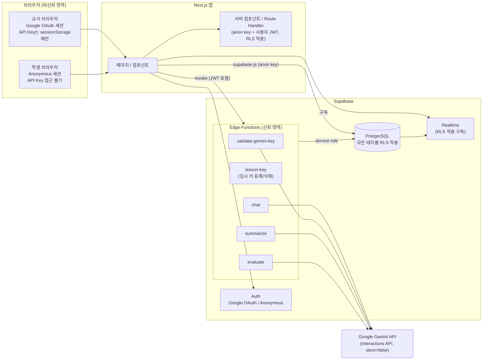
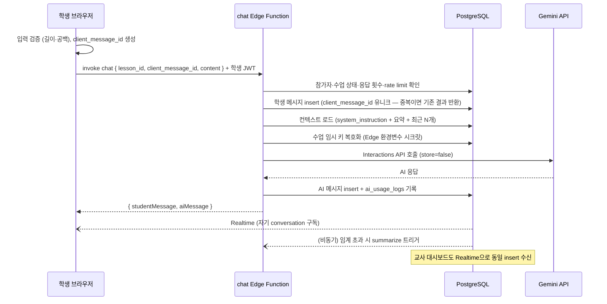

# ARCHITECTURE — 시스템 아키텍처

- 문서 버전: 0.1 (PHASE 0)
- 관련 문서: DATABASE_DESIGN.md, AI_ARCHITECTURE.md, SECURITY_MODEL.md

---

## 1. 기술 스택

| 계층 | 기술 | 비고 |
|---|---|---|
| Frontend | Next.js (App Router) + TypeScript + React + Tailwind CSS | 프로젝트 생성 시점의 stable 버전 확인 후 고정 (PHASE 1) |
| Backend / DB | Supabase — PostgreSQL, Auth, Realtime, Edge Functions | 관리형 사용 |
| AI | Google Gemini API — 공식 `@google/genai` SDK, Interactions API | Edge Function에서만 호출 |
| 배포 | 특정 플랫폼 비종속 (Node.js 호스팅 어디든) | PHASE 12에서 결정 |

버전 정책: PHASE 1에서 각 라이브러리의 stable 버전을 확인하여 `package.json`에 고정하고, 이 문서에 기록을 추가한다. 임의의 버전을 미리 하드코딩하지 않는다.

확정 버전 (2026-08-12, PHASE 1 — npm 레지스트리 stable 기준 고정):

| 패키지 | 버전 |
|---|---|
| next | 16.3.0 |
| react / react-dom | 19.2.8 |
| typescript | 7.0.2 |
| tailwindcss / @tailwindcss/postcss | 4.3.3 |
| @supabase/supabase-js | 2.112.3 |
| @supabase/ssr | 0.12.4 |
| Node.js (개발 환경) | 22.x |

`@google/genai`는 PHASE 4(첫 Gemini 사용 시점)에서 stable 확인 후 고정한다.

## 2. 시스템 구성도



## 3. 구성 요소별 책임

| 구성 요소 | 책임 | 하지 않는 것 |
|---|---|---|
| Next.js UI | 화면 렌더링, 입력 1차 검증, Realtime 구독, Edge Function 호출 | Gemini 직접 호출, service role 사용, 권한 판단 |
| Next.js 서버 (RSC/Route Handler) | 세션 쿠키 관리, 페이지 데이터 로드 (사용자 JWT + RLS) | service role 사용 (원칙적으로 금지, 예외는 문서화 필요) |
| Supabase Auth | 교사 OAuth, 학생 익명 인증, JWT 발급 | — |
| PostgreSQL + RLS | 데이터 저장, 행 단위 접근 제어 (최후의 방어선) | 비즈니스 로직 전부를 담지 않음 (검증은 EF와 이중화) |
| Realtime | messages/participants 변경을 교사 대시보드·학생 화면에 push | RLS를 우회한 브로드캐스트 |
| Edge Functions | Gemini 호출 전담, 키 복호화, 권한 재검증, rate limit, idempotency, 사용 로그 기록 | 키/원문 로깅 |
| Gemini API | 대화 생성, 요약, 평가 (stateless — store=false) | 대화 기록 저장 (SoT 아님) |

## 4. 핵심 결정 사항 (ADR 요약)

| # | 결정 | 근거 | 대안(기각 사유) |
|---|---|---|---|
| A1 | Gemini 호출은 **Edge Function에서만** | 키 보호, 로깅 통제, rate limit 일원화 | 브라우저 직접 호출(키 노출), Next API Route(가능하나 Supabase 인접 배치·service role 관리 일원화를 위해 EF 선택) |
| A2 | 학생 메시지 저장과 AI 호출을 **하나의 chat EF가 처리** | 순서 보장·idempotency·실패 복구가 단일 지점에서 처리됨 | 클라이언트가 직접 insert 후 EF 호출(경합·중복 위험 증가) |
| A3 | 대화 SoT는 Supabase, Gemini `store=false` | 데이터 소유권, 학생 기록 통제 | Gemini Interaction 저장 의존(외부 종속·삭제 통제 불가) |
| A4 | BYOK 키는 수업 활성 기간에만 **암호화 임시 저장** (TTL, 종료 시 삭제) | 학생 채팅 시 서버가 키를 사용해야 하는데 학생은 키를 가질 수 없음 | 상세 비교는 SECURITY_MODEL.md §5 |
| A5 | 모델명은 중앙 설정 (`lib/ai/gemini-models.ts` 단일 소스) | 모델 교체 용이 | 파일별 하드코딩(변경 누락 위험) |
| A6 | `lib/ai/`는 런타임 비종속 순수 TS로 작성 | Next(Node)와 Edge Function(Deno) 양쪽에서 동일 로직 재사용 (오류 정규화·타입·모델 상수) | 계층 이원화(정의 불일치 위험) |
| A7 | 평가는 메시지마다가 아니라 **명시적 일괄 실행** | 비용·일관성. 평가는 전체 대화 맥락 필요 | 실시간 평가(비용 폭증, 근거 불안정) |
| A8 | 학생 참여는 security definer RPC (`join_lesson`) | 코드 검증 + participant 생성의 원자성, 수업 정보 노출 최소화 | 클라이언트 직접 insert(코드 무차별 대입에 수업 정보 노출) |

## 5. 디렉터리 구조 (PHASE 1에서 생성 예정)

```
.
├── app/
│   ├── (teacher)/
│   │   ├── login/
│   │   ├── dashboard/
│   │   ├── classes/[classId]/
│   │   ├── lessons/[lessonId]/
│   │   │   ├── edit/
│   │   │   ├── dashboard/
│   │   │   └── students/[participantId]/
│   │   └── settings/ai/
│   ├── (student)/
│   │   ├── join/[code]/
│   │   └── chat/
│   └── layout.tsx
├── components/
│   ├── teacher/
│   ├── student/
│   └── ui/
├── lib/
│   ├── ai/                      # 런타임 비종속 순수 TS (Next + EF 공용)
│   │   ├── gemini-models.ts     # AI_MODEL_CHAT 등 중앙 모델 설정
│   │   ├── gemini-errors.ts     # 오류 정규화 (코드·한국어 안내)
│   │   ├── gemini-types.ts      # 요청/응답/평가 JSON 타입
│   │   └── prompts/             # 시스템 프롬프트 조립기
│   ├── supabase/
│   │   ├── client.ts            # 브라우저 클라이언트 (anon key)
│   │   ├── server.ts            # 서버 컴포넌트용 클라이언트
│   │   └── middleware.ts        # 세션 갱신
│   └── domain/                  # 수업/참여/평가 도메인 로직·검증 스키마
├── supabase/
│   ├── migrations/              # SQL 마이그레이션 (RLS 포함)
│   └── functions/
│       ├── _shared/             # EF 공용: 인증·권한·rate limit·키 암호화
│       ├── validate-gemini-key/
│       ├── lesson-key/
│       ├── chat/
│       ├── summarize/
│       └── evaluate/
└── docs/                        # 본 설계 문서
```

주: `lib/ai/gemini-client.ts`(SDK 래퍼)와 `gemini-validator.ts`(검증 로직)는 실제 Gemini SDK 호출을 포함하므로 Edge Function 측(`supabase/functions/_shared/ai/`)에 두고, 브라우저/Next에서는 타입·오류 코드·모델 상수만 import한다. SDK가 포함된 코드는 클라이언트 번들에 절대 포함하지 않는다.

## 6. Edge Functions 목록

| 함수 | 호출자 | 입력 | 동작 | 출력 |
|---|---|---|---|---|
| `validate-gemini-key` | 교사 | API Key, 대상 모델 | 인증 확인 → Gemini 최소 테스트 호출 → 오류 정규화 | `{ ok, errorCode?, koreanMessage? }` |
| `lesson-key` | 교사 | lesson_id, API Key(등록 시) | 수업 소유 확인 → 키 암호화 저장 / 삭제 | `{ ok }` |
| `chat` | 학생 | lesson_id, client_message_id, content | 참가자 확인 → rate limit → idempotency → 학생 메시지 저장 → 컨텍스트 조립 → Gemini 호출 → AI 메시지 저장 → 로그 | `{ studentMessage, aiMessage }` 또는 정규화 오류 |
| `summarize` | chat EF 내부 트리거 | conversation_id | 대화가 임계 길이 초과 시 요약 생성·저장 | `{ ok }` |
| `evaluate` | 교사 | lesson_id 또는 conversation_id, rubric_id | 소유 확인 → 대화 수집 → Gemini 구조화 평가 → JSON 검증 → evidence 검증 → 저장 | `{ evaluationId, status }` |

모든 EF 공통 사항: 호출자 JWT 검증 → 권한 재검증(RLS에만 의존하지 않음) → zod 입력 검증 → 정규화된 오류 응답 → `ai_usage_logs` 기록(민감정보 제외).

## 7. 학생 채팅 데이터 흐름 (시퀀스)



실패 처리: Gemini 호출 실패 시 학생 메시지는 저장 상태로 유지하고 정규화 오류를 반환한다. 클라이언트가 같은 `client_message_id`로 재시도하면 학생 메시지 insert는 건너뛰고 AI 응답 생성만 다시 수행한다.

## 8. Realtime 채널 설계

| 구독자 | 채널 | 이벤트 | 접근 제어 |
|---|---|---|---|
| 학생 | 자기 conversation의 `messages` INSERT | AI 응답 수신 | RLS (자기 대화만) |
| 교사 | 수업의 `messages` INSERT, `participants` INSERT/UPDATE | 실시간 관찰·참여 현황 | RLS (자기 수업만) |

Realtime 구독에도 RLS가 적용되도록 Postgres Changes + RLS 조합을 사용한다. 대시보드 초기 로드는 일반 쿼리, 이후 변경분만 Realtime으로 수신한다.

## 9. 환경 변수 (PHASE 1~2에서 설정)

| 변수 | 위치 | 용도 |
|---|---|---|
| `NEXT_PUBLIC_SUPABASE_URL` | Next.js | Supabase 프로젝트 URL |
| `NEXT_PUBLIC_SUPABASE_ANON_KEY` | Next.js | 공개 anon key (RLS 전제) |
| `SUPABASE_SERVICE_ROLE_KEY` | Edge Function 전용 | DB 관리 작업 (브라우저·Next 클라이언트 금지) |
| `LESSON_KEY_ENCRYPTION_SECRET` | Edge Function 전용 | BYOK 키 AES-256-GCM 암호화용 시크릿 |
| Google OAuth Client ID/Secret | Supabase Auth 설정 | 교사 로그인 |

Gemini API Key는 환경 변수로 두지 않는다 — 교사별 BYOK이며 서버 상시 보관 대상이 아니다.
