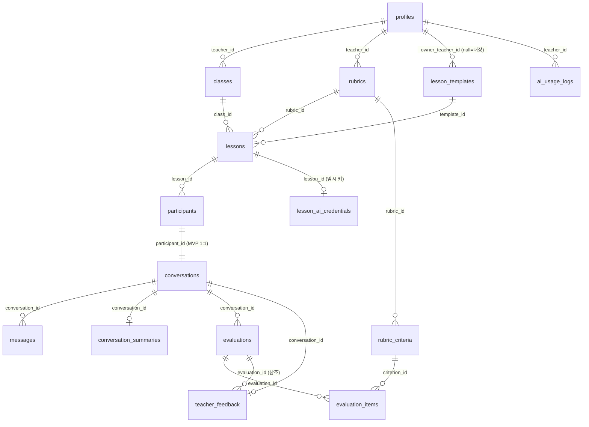

# DATABASE_DESIGN — 데이터베이스 설계

- 문서 버전: 0.1 (PHASE 0)
- 관련 문서: ARCHITECTURE.md, SECURITY_MODEL.md
- 원칙: **RLS 없는 public 테이블을 만들지 않는다.** 모든 테이블에 `created_at`, `updated_at`을 둔다 (`moddatetime` 트리거로 자동 갱신).

---

## 1. ERD

사용자 요구 엔터티 13종에 더해, 설계상 2개 테이블을 추가한다.

| 추가 테이블 | 이유 |
|---|---|
| `evaluation_items` | 평가를 "실행(run)"과 "criterion별 결과"로 분리. 재실행 이력 관리와 criterion 단위 근거 연결(`evidence_message_ids`)이 깔끔해짐 |
| `lesson_ai_credentials` | BYOK 키의 수업 활성 기간 한정 암호화 보관 (근거: SECURITY_MODEL.md §5). 클라이언트 접근 전면 차단(deny-all RLS) |

## 2. 공통 규칙

- PK: `id uuid primary key default gen_random_uuid()` (예외: `profiles.id`는 `auth.users.id` 참조, `lesson_ai_credentials`는 `lesson_id`가 PK)
- 타임스탬프: `created_at timestamptz not null default now()`, `updated_at timestamptz not null default now()` + 갱신 트리거
- enum 성격의 컬럼은 `text + check` 제약 (마이그레이션 유연성)
- 모든 테이블 `alter table ... enable row level security` — **정책 없는 활성화는 기본 거부(deny-all)**이므로, 필요한 정책만 명시적으로 추가

## 3. 테이블 정의

### 3.1 profiles — 교사 프로필

auth.users와 1:1. 학생(익명)은 profiles 행을 만들지 않는다.

| 컬럼 | 타입 | 제약 |
|---|---|---|
| id | uuid | PK, FK → auth.users(id) ON DELETE CASCADE |
| role | text | not null, check in ('teacher'), default 'teacher' |
| display_name | text | not null |
| email | text | not null |
| created_at / updated_at | timestamptz | not null |

- 생성: 최초 OAuth 로그인 시 (auth.users insert 트리거 또는 로그인 후 upsert)
- 인덱스: PK로 충분
- 삭제: 계정 삭제 시 cascade → classes 이하 전부 연쇄 삭제

### 3.2 classes — 학급/그룹

| 컬럼 | 타입 | 제약 |
|---|---|---|
| id | uuid | PK |
| teacher_id | uuid | not null, FK → profiles(id) ON DELETE CASCADE |
| name | text | not null (예: "3학년 2반 과학") |
| description | text | null 허용 |
| created_at / updated_at | timestamptz | not null |

- 인덱스: `(teacher_id)`

### 3.3 lessons — 수업

| 컬럼 | 타입 | 제약 |
|---|---|---|
| id | uuid | PK |
| class_id | uuid | not null, FK → classes(id) ON DELETE CASCADE |
| teacher_id | uuid | not null, FK → profiles(id) ON DELETE CASCADE — RLS 단순화를 위한 비정규화 (class.teacher_id와 트리거로 일치 보장) |
| title | text | not null |
| subject_type | text | not null, check in ('reading','science') |
| topic | text | not null |
| goals | text | not null (학생 공개) |
| system_instruction | text | not null (**학생 비공개** — §5.3 참고) |
| difficulty | text | not null, check in ('easy','normal','hard'), default 'normal' |
| max_student_messages | int | not null, default 20, check 5~50 |
| show_score_to_student | boolean | not null, default false |
| join_code | text | not null, unique (6자리 대문자 영숫자, 충돌 시 재생성) |
| status | text | not null, check in ('draft','active','ended','archived'), default 'draft' |
| template_id | uuid | null, FK → lesson_templates(id) ON DELETE SET NULL |
| rubric_id | uuid | null, FK → rubrics(id) ON DELETE SET NULL (활성화 시 not null 검증) |
| started_at / ended_at | timestamptz | null |
| created_at / updated_at | timestamptz | not null |

- 인덱스: `(teacher_id)`, `(class_id)`, `unique(join_code)`
- 학생 노출 컬럼 제한: 학생에게는 `system_instruction` 등 내부 컬럼을 감추기 위해 **공개 뷰 `lesson_student_view`** (id, title, goals, topic, subject_type, status, max_student_messages, show_score_to_student)를 두고, 학생 화면은 이 뷰(또는 RPC 반환값)만 사용한다.

### 3.4 participants — 수업 참여 학생

| 컬럼 | 타입 | 제약 |
|---|---|---|
| id | uuid | PK |
| lesson_id | uuid | not null, FK → lessons(id) ON DELETE CASCADE |
| user_id | uuid | not null (익명 세션의 auth.uid — auth.users FK는 두지 않음: 익명 유저 정리 정책과 분리) |
| nickname | text | not null, 길이 1~20 check |
| status | text | not null, check in ('active','completed','kicked'), default 'active' |
| joined_at | timestamptz | not null default now() |
| last_seen_at | timestamptz | null |
| created_at / updated_at | timestamptz | not null |

- 제약: `unique(lesson_id, user_id)`, `unique(lesson_id, nickname)`
- 인덱스: `(lesson_id)`, `(user_id)`
- 생성 경로: **security definer RPC `join_lesson(code, nickname)`만** (직접 insert 금지 — join_code 검증·상태 검증·닉네임 충돌 처리를 원자적으로 수행)

### 3.5 conversations — 학생-AI 대화 세션

| 컬럼 | 타입 | 제약 |
|---|---|---|
| id | uuid | PK |
| participant_id | uuid | not null, unique (MVP: participant당 1개), FK → participants(id) ON DELETE CASCADE |
| lesson_id | uuid | not null, FK → lessons(id) ON DELETE CASCADE (조회 최적화용 비정규화) |
| status | text | not null, check in ('active','completed'), default 'active' |
| student_message_count | int | not null default 0 (응답 횟수 제한 판정용 — chat EF가 갱신) |
| created_at / updated_at | timestamptz | not null |

- 인덱스: `(lesson_id)`, `unique(participant_id)`
- 생성: `join_lesson` RPC가 participant와 함께 생성

### 3.6 messages — 발화

| 컬럼 | 타입 | 제약 |
|---|---|---|
| id | uuid | PK |
| conversation_id | uuid | not null, FK → conversations(id) ON DELETE CASCADE |
| sender | text | not null, check in ('student','ai','system') |
| content | text | not null, 길이 1~4000 check |
| client_message_id | uuid | null (학생 메시지 idempotency 키) |
| created_at / updated_at | timestamptz | not null (메시지는 불변 — update 정책을 만들지 않음) |

- 제약: `unique(conversation_id, client_message_id)` (partial: client_message_id is not null)
- 인덱스: `(conversation_id, created_at)` — 대화 순서 조회의 기본 인덱스
- 쓰기 경로: 학생/AI 메시지 모두 **chat EF(service role)가 insert** (순서·검증·idempotency 일원화). 클라이언트 직접 insert 정책은 두지 않는다.

### 3.7 rubrics — 루브릭

| 컬럼 | 타입 | 제약 |
|---|---|---|
| id | uuid | PK |
| teacher_id | uuid | not null, FK → profiles(id) ON DELETE CASCADE |
| name | text | not null |
| description | text | null |
| subject_type | text | not null, check in ('reading','science') |
| source_template_id | uuid | null, FK → lesson_templates(id) ON DELETE SET NULL (어느 템플릿에서 복제했는지) |
| created_at / updated_at | timestamptz | not null |

- 인덱스: `(teacher_id)`

### 3.8 rubric_criteria — 평가 기준 항목

| 컬럼 | 타입 | 제약 |
|---|---|---|
| id | uuid | PK |
| rubric_id | uuid | not null, FK → rubrics(id) ON DELETE CASCADE |
| name | text | not null (예: "텍스트 근거 활용") |
| description | text | not null (AI 평가 프롬프트에 그대로 들어가는 기준 설명) |
| max_score | int | not null, check 1~100 |
| order_index | int | not null |
| created_at / updated_at | timestamptz | not null |

- 제약: `unique(rubric_id, order_index)`
- 인덱스: `(rubric_id)`
- 삭제: 평가에서 참조 중이면 RESTRICT (evaluation_items FK) — 평가 이력 무결성 보호

### 3.9 evaluations — AI 평가 실행 (run 단위)

| 컬럼 | 타입 | 제약 |
|---|---|---|
| id | uuid | PK |
| conversation_id | uuid | not null, FK → conversations(id) ON DELETE CASCADE |
| rubric_id | uuid | not null, FK → rubrics(id) ON DELETE RESTRICT (평가가 있으면 루브릭 삭제 불가) |
| status | text | not null, check in ('pending','running','completed','failed') |
| model | text | not null (실행 시점 모델 기록) |
| total_score / max_total_score | int | null (completed 시 채움) |
| overall_comment | text | null (전체 총평) |
| error_type | text | null (failed 시 정규화 오류 코드) |
| created_at / updated_at | timestamptz | not null |

- 인덱스: `(conversation_id, created_at desc)` — 최신 평가 조회
- 재실행: 새 row 생성 (이력 보존). UI는 최신 completed 건 사용

### 3.10 evaluation_items — criterion별 평가 결과

사용자 요구 구조(criterion_id, score, max_score, evidence_message_ids, reason, feedback, confidence)를 그대로 반영.

| 컬럼 | 타입 | 제약 |
|---|---|---|
| id | uuid | PK |
| evaluation_id | uuid | not null, FK → evaluations(id) ON DELETE CASCADE |
| criterion_id | uuid | not null, FK → rubric_criteria(id) ON DELETE RESTRICT |
| score | int | not null |
| max_score | int | not null (실행 시점 배점 스냅샷) |
| evidence_message_ids | uuid[] | not null default '{}' — **저장 전 실제 해당 대화의 message id인지 서버 검증** (AI_ARCHITECTURE.md §8) |
| reason | text | not null (판단 근거 서술) |
| feedback | text | not null (해당 기준에 대한 학생 피드백 초안) |
| confidence | numeric(3,2) | not null, check 0~1 |
| created_at / updated_at | timestamptz | not null |

- 제약: `unique(evaluation_id, criterion_id)`
- 인덱스: `(evaluation_id)`
- 근거 클릭 이동: UI가 `evidence_message_ids` → 대화 화면의 해당 message로 스크롤 (message id 앵커)

### 3.11 teacher_feedback — 교사 확정 피드백

| 컬럼 | 타입 | 제약 |
|---|---|---|
| id | uuid | PK |
| conversation_id | uuid | not null, unique, FK → conversations(id) ON DELETE CASCADE |
| evaluation_id | uuid | null, FK → evaluations(id) ON DELETE SET NULL (어느 평가를 기반으로 했는지) |
| ai_draft | text | null (AI가 생성한 종합 피드백 초안 스냅샷) |
| final_text | text | null (교사가 수정·확정한 본문) |
| final_score / final_max_score | int | null (교사가 조정한 최종 점수 — 선택) |
| status | text | not null, check in ('draft','confirmed'), default 'draft' |
| confirmed_at | timestamptz | null |
| created_at / updated_at | timestamptz | not null |

- 학생 공개 조건: `status='confirmed'` **AND** 해당 lesson의 `show_score_to_student=true`인 경우에만 학생 RLS select 허용

### 3.12 lesson_templates — 수업 템플릿

| 컬럼 | 타입 | 제약 |
|---|---|---|
| id | uuid | PK |
| owner_teacher_id | uuid | null, FK → profiles(id) ON DELETE CASCADE — **null이면 내장(built-in) 템플릿** |
| subject_type | text | not null, check in ('reading','science') |
| name | text | not null (예: "Claim-Evidence-Reasoning") |
| description | text | not null |
| system_instruction | text | not null (AI 역할 템플릿) |
| default_goals | text | null |
| default_rubric | jsonb | not null — criterion 배열 `[{name, description, max_score, order_index}]` (수업 생성 시 rubrics/rubric_criteria로 복제) |
| is_builtin | boolean | not null, default false |
| created_at / updated_at | timestamptz | not null |

- 인덱스: `(subject_type)`, `(owner_teacher_id)`
- 내장 템플릿은 seed 마이그레이션으로 주입 (PHASE 9·10)

### 3.13 conversation_summaries — 대화 요약 (토큰 절약용)

| 컬럼 | 타입 | 제약 |
|---|---|---|
| id | uuid | PK |
| conversation_id | uuid | not null, unique, FK → conversations(id) ON DELETE CASCADE (최신 요약 1건 유지·덮어쓰기) |
| summary | text | not null |
| last_message_id | uuid | not null, FK → messages(id) ON DELETE CASCADE (어디까지 요약했는지) |
| message_count_at_summary | int | not null |
| model | text | not null |
| created_at / updated_at | timestamptz | not null |

- 쓰기: summarize EF(service role)만

### 3.14 ai_usage_logs — AI 사용 로그

**API Key·대화 원문·프롬프트를 절대 저장하지 않는다.**

| 컬럼 | 타입 | 제약 |
|---|---|---|
| id | uuid | PK |
| teacher_id | uuid | not null, FK → profiles(id) ON DELETE CASCADE |
| lesson_id | uuid | null, FK → lessons(id) ON DELETE SET NULL |
| conversation_id | uuid | null, FK → conversations(id) ON DELETE SET NULL |
| request_type | text | not null, check in ('validate','chat','summary','evaluation') |
| model | text | not null |
| success | boolean | not null |
| error_type | text | null (정규화 코드만) |
| latency_ms | int | not null |
| usage_metadata | jsonb | null (estimated_tokens 등 SDK가 주는 사용량 메타데이터만) |
| created_at / updated_at | timestamptz | not null |

- 인덱스: `(teacher_id, created_at desc)`
- 쓰기: EF(service role)만. 교사는 자기 로그 select만

### 3.15 lesson_ai_credentials — BYOK 임시 키 (클라이언트 접근 전면 차단)

| 컬럼 | 타입 | 제약 |
|---|---|---|
| lesson_id | uuid | PK, FK → lessons(id) ON DELETE CASCADE |
| encrypted_key | bytea | not null — AES-256-GCM (`LESSON_KEY_ENCRYPTION_SECRET`로 암호화, IV 포함) |
| key_last4 | text | not null (교사 UI 표시용 끝 4자리) |
| expires_at | timestamptz | not null (기본: 등록 후 24시간) |
| created_at / updated_at | timestamptz | not null |

- RLS: **정책 0개 (deny-all)** — anon/authenticated 어느 역할도 접근 불가. lesson-key/chat/evaluate EF(service role)만 접근
- 삭제: 수업 `ended` 전환 시 즉시 삭제 + `expires_at` 경과분 정리 (pg_cron 또는 EF 접근 시 lazy 삭제)
- 평문 저장 금지, 로그 출력 금지

## 4. 삭제 정책 요약

| 삭제 주체 | 연쇄 효과 |
|---|---|
| 교사 계정 삭제 | profiles → classes → lessons → participants/conversations/messages/평가 전부 cascade |
| Class 삭제 | 하위 lessons 이하 전부 cascade |
| Lesson 삭제 | participants, conversations, messages, summaries, evaluations, feedback, 임시 키 cascade. ai_usage_logs는 lesson_id만 SET NULL (통계 보존) |
| Rubric 삭제 | 평가 이력이 참조 중이면 RESTRICT로 차단 (lessons.rubric_id는 SET NULL) |
| Template 삭제 | lessons.template_id, rubrics.source_template_id SET NULL (복제본은 독립적으로 유지) |
| 익명 학생 정리 | participants는 auth.users FK를 갖지 않으므로 Supabase의 익명 유저 정리와 무관하게 학습 기록 보존 |

## 5. RLS 정책 매트릭스

`T` = 수업 소유 교사(`auth.uid() = teacher_id` 경로), `S` = 본인 학생(`auth.uid() = participants.user_id` 경로), `EF` = service role(Edge Function).

| 테이블 | SELECT | INSERT | UPDATE | DELETE |
|---|---|---|---|---|
| profiles | 본인 | 본인(최초 로그인) | 본인 | 본인 |
| classes | T | T | T | T |
| lessons | T 전체 / S는 뷰·RPC로 공개 컬럼만 | T | T | T |
| participants | T, S(본인 행) | **RPC만** | T(상태 변경), S(last_seen) | T |
| conversations | T, S(본인) | RPC만 | EF만 | (lesson cascade) |
| messages | T, S(본인 대화) | **EF만** | 없음 (불변) | (cascade) |
| rubrics / rubric_criteria | T | T | T | T (RESTRICT 예외) |
| evaluations / evaluation_items | T | EF만 | EF만 | T |
| teacher_feedback | T / S는 confirmed+공개설정 시 본인 것만 | T, EF(초안) | T | T |
| lesson_templates | 내장은 모든 교사, 개인은 소유자 | 소유자 | 소유자 | 소유자 |
| conversation_summaries | T | EF만 | EF만 | (cascade) |
| ai_usage_logs | T(본인) | EF만 | 없음 | 없음 |
| lesson_ai_credentials | **없음 (deny-all)** | EF만 | EF만 | EF만 |

### 5.1 정책 구현 원칙

- 교사 판정 helper: `is_lesson_teacher(lesson_id)` — `security definer` 함수로 lessons.teacher_id 확인 (정책 내 서브쿼리 중복 제거 + 성능)
- 학생 판정 helper: `is_own_participant(participant_id)` — participants.user_id = auth.uid()
- **서비스 로직과 RLS의 이중 방어**: EF가 권한을 검증하더라도 RLS는 항상 독립적으로 동일 결론을 내리도록 작성 (EF 버그 시 최후 방어선)
- 학생의 lessons 접근은 row 접근을 열더라도 **컬럼 노출은 뷰/RPC로 제한** (system_instruction 유출 = 프롬프트 유출)

### 5.2 RLS 검증 시나리오 (PHASE 3, 11에서 테스트로 구현)

1. 교사 A가 교사 B의 class/lesson/대화/평가를 select/update/delete 시도 → 전부 0 rows/거부
2. 학생 A(JWT)가 학생 B의 participant/conversation/messages select 시도 → 0 rows
3. 학생이 lessons의 system_instruction select 시도 → 차단(뷰에 컬럼 없음)
4. 학생이 messages 직접 insert 시도 → 거부 (EF 경유만 가능)
5. anon(비로그인)이 모든 테이블 select → 전부 거부
6. 학생이 lesson_ai_credentials select → 거부 (정책 없음)
7. 학생이 확정 전 teacher_feedback select → 0 rows; 확정+공개 설정 후 본인 것만 1 row

## 6. 마이그레이션 운영 원칙

- 모든 스키마 변경은 `supabase/migrations/`의 SQL 파일로 관리 (순번·설명 포함 파일명)
- 테이블 생성 마이그레이션에 **RLS 활성화 + 정책 + 트리거 + 인덱스를 같은 파일에 포함** (RLS 누락 커밋이 구조적으로 불가능하게)
- PHASE별 마이그레이션 단위는 PHASE_PLAN.md 참조
