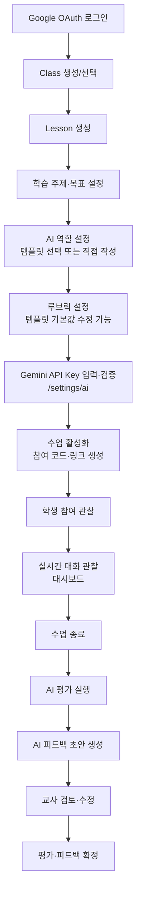
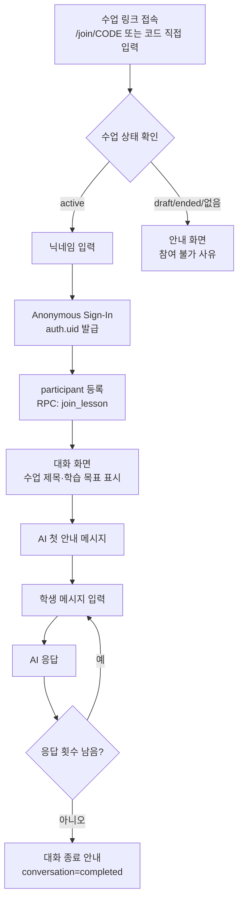
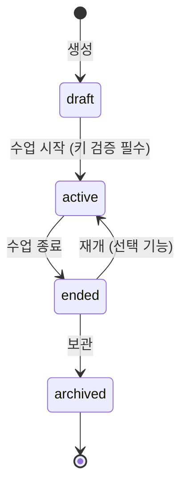

# USER_FLOW — 사용자 흐름 설계

- 문서 버전: 0.1 (PHASE 0)
- 관련 문서: PRODUCT_SPEC.md, ARCHITECTURE.md, DATABASE_DESIGN.md

---

## 1. 교사 핵심 흐름

### 1.1 단계별 상세

| 단계 | 화면 | 교사 행동 | 시스템 동작 | 실패/예외 처리 |
|---|---|---|---|---|
| 로그인 | `/login` | Google 계정 선택 | Supabase Auth OAuth → `profiles` 생성/갱신 | OAuth 실패 → 재시도 안내 |
| 수업 생성 | `/classes/[id]/lessons/new` | 제목·주제·목표·난이도·응답 횟수·점수 공개 설정 | `lessons` insert (status=`draft`) | 입력 검증 오류 → 필드별 안내 |
| AI 역할 설정 | 수업 편집 화면 | 템플릿 선택 후 수정 or 직접 작성 | `system_instruction` 저장 | — |
| 루브릭 설정 | 수업 편집 화면 | 템플릿 루브릭 복제 후 criterion 수정 | `rubrics`, `rubric_criteria` insert | criterion 0개면 활성화 차단 |
| API Key 검증 | `/settings/ai` | Key 입력 → 테스트 | Edge Function이 Gemini 테스트 호출, 정규화된 결과 표시 | 오류 코드별 한국어 해결 안내 (AI_ARCHITECTURE.md §7) |
| 수업 활성화 | 수업 상세 | "수업 시작" 클릭 | status=`active`, `join_code` 확정, 키를 수업용 임시 암호화 저장소에 등록 (SECURITY_MODEL.md §5) | 키 미검증 상태면 활성화 차단 |
| 실시간 관찰 | `/lessons/[id]/dashboard` | 학생 목록·대화 열람 | Supabase Realtime 구독 (messages insert) | 연결 끊김 → 자동 재구독 + 수동 새로고침 |
| 수업 종료 | 대시보드 | "수업 종료" 클릭 | status=`ended`, 학생 입력 차단, 임시 키 삭제 예약 | 종료 후에도 대화 열람은 가능 |
| AI 평가 실행 | 대시보드 | "AI 평가 실행" 클릭 | 대화별 evaluation Edge Function 호출 (일괄) | 실패 학생만 개별 재실행 가능 |
| 검토·확정 | Student Detail | 점수·피드백 수정 후 확정 | `teacher_feedback` status=`confirmed` | 확정 전에는 학생에게 어떤 점수도 비공개 |

## 2. 학생 핵심 흐름

### 2.1 단계별 상세

| 단계 | 화면 | 학생 행동 | 시스템 동작 | 실패/예외 처리 |
|---|---|---|---|---|
| 접속 | `/join/[code]` | 링크 클릭 or 코드 입력 | 코드로 수업 조회 (RPC, 공개 정보만) | 잘못된/만료 코드 → "코드를 확인해 주세요" |
| 닉네임 | 참여 화면 | 닉네임 입력 (실명 지양 안내) | 익명 인증 → `join_lesson(code, nickname)` RPC | 닉네임 중복 → "이미 사용 중인 닉네임입니다" |
| 대화 | `/chat` | 메시지 입력 | 메시지 저장 → Edge Function → AI 응답 저장 → 화면 갱신 | 전송 실패 → 재시도 버튼 (client_message_id로 중복 방지) |
| 진행 확인 | 대화 화면 상단 | — | 남은 응답 횟수 / 진행 상태 표시 | — |
| 종료 | 대화 화면 | — | 횟수 소진 or 수업 종료 시 입력 비활성화 | 종료 후 자기 대화는 읽기 가능 |

### 2.2 학생 화면 구성 (단순화 원칙)

우선 구현 요소는 다음 5가지뿐이다: **수업 제목 / 학습 목표 / 대화 영역 / 입력 영역 / 진행 상태**.

## 3. 상태 머신

### 3.1 Lesson 상태

| 상태 | 학생 참여 | 학생 대화 | 교사 편집 | 비고 |
|---|---|---|---|---|
| draft | ✗ | ✗ | 전체 가능 | 코드 비공개 |
| active | ✓ | ✓ | 제한적 (목표·루브릭 잠금) | 임시 키 등록됨 |
| ended | ✗ | ✗ (열람만) | 평가·피드백만 | 임시 키 삭제 |
| archived | ✗ | ✗ | 열람만 | 목록에서 숨김 |

### 3.2 Conversation 상태

`active` (대화 중) → `completed` (횟수 소진 or 수업 종료). 완료 후에는 학생 insert가 RLS+검증 양쪽에서 차단된다.

### 3.3 평가·피드백 상태

- Evaluation: `pending → running → completed | failed` (재실행 시 새 evaluation 생성, 최신본 사용)
- Teacher Feedback: `draft → confirmed` (확정 후 수정 시 다시 draft로 되돌리는 대신 confirmed 상태에서 직접 수정·재확정 — 이력은 updated_at로 추적)

## 4. 엣지 케이스 및 정책

| # | 상황 | 정책 |
|---|---|---|
| E1 | 잘못된/존재하지 않는 참여 코드 | 수업 정보를 일절 노출하지 않고 "코드를 확인해 주세요"만 표시 (코드 존재 여부 추측 방지) |
| E2 | draft/ended 수업에 접속 | "아직 시작하지 않은 수업" / "종료된 수업" 안내. ended의 기존 참가자는 자기 대화 읽기 전용 열람 |
| E3 | 닉네임 중복 | 같은 수업 내 닉네임 유일 제약. 중복 시 다른 닉네임 요구 |
| E4 | 같은 브라우저 재접속 | 익명 세션이 유지되므로 기존 participant로 자동 복원 (대화 이어짐) |
| E5 | 세션 유실/다른 기기 접속 | 새 auth.uid → 기존 participant에 접근 불가. 새 닉네임으로 새 참여 (기존 대화 병합은 post-MVP). 참여 화면에 "기존 기기를 사용하세요" 안내 |
| E6 | 메시지 전송 중 네트워크 끊김 | 클라이언트가 동일 `client_message_id`로 재시도 → 서버는 중복 저장하지 않고 기존 처리 결과 반환 |
| E7 | AI 응답 실패 (Gemini 오류) | 학생 메시지는 저장 유지. 학생에게는 "선생님의 AI 설정에 문제가 있어요. 잠시 후 다시 시도해 주세요" 수준의 일반화된 안내. 상세 오류는 교사 대시보드에만 표시 |
| E8 | 응답 횟수 소진 | 입력창 비활성화 + 마무리 안내 메시지. conversation=`completed` |
| E9 | 수업 중 교사 키 quota 소진 | 학생에게 일반화 안내, 교사 대시보드에 `QUOTA_EXHAUSTED` 경고 배지 |
| E10 | 학생의 도배/과대 입력 | 메시지 길이 제한(2,000자) + 분당 전송 제한 + 동시 요청 1건 (Edge Function에서 강제) |
| E11 | 교사가 active 수업 삭제 시도 | 확인 대화상자 + ended 상태를 거치도록 유도. 삭제 시 관련 데이터 cascade 삭제임을 명시 |
| E12 | 교사 다중 수업 동시 진행 | 허용. 임시 키는 lesson 단위로 등록 |
| E13 | 학생이 수업과 무관한 대화 시도 | AI가 학습 주제로 복귀 유도 (시스템 지시). 반복 시 교사 대시보드에서 확인 가능 |
| E14 | AI 평가 실행 중 일부 대화 실패 | 대화별 독립 실행 — 성공분은 저장, 실패분만 재실행 |

## 5. 화면 목록 (MVP)

### 교사 (PC 우선)

| 경로 | 화면 | PHASE |
|---|---|---|
| `/login` | 로그인 | 2 |
| `/dashboard` | 내 Class/Lesson 목록 | 3 |
| `/classes/[classId]` | Class 상세 (Lesson 목록) | 3 |
| `/lessons/[lessonId]/edit` | 수업 설계 (목표·AI 역할·루브릭) | 3, 7 |
| `/settings/ai` | Gemini Key Validator | 4 |
| `/lessons/[lessonId]/dashboard` | 수업 대시보드 (Overview / Student List) | 6 |
| `/lessons/[lessonId]/students/[participantId]` | Student Detail (대화·평가·피드백) | 6~8 |

### 학생 (모바일 대응)

| 경로 | 화면 | PHASE |
|---|---|---|
| `/join/[code]` | 참여 (닉네임 입력) | 3 |
| `/chat` | 대화 화면 | 5 |
